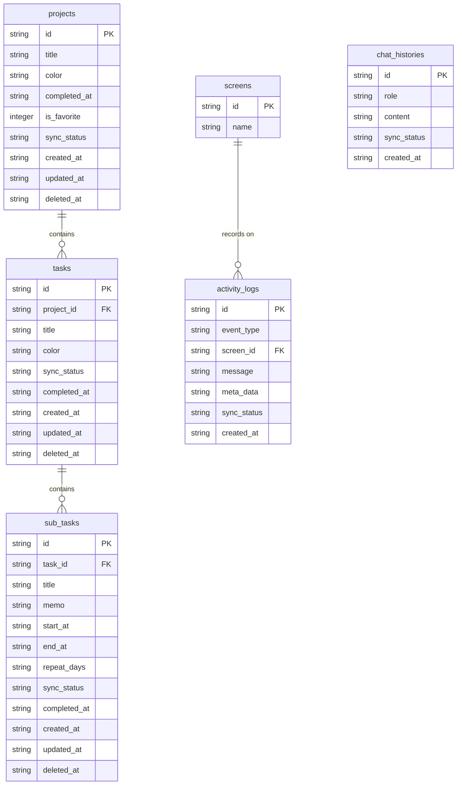

# 設計書 (Design Document)

## 1. 外部設計

- **画面設計 (Gemini作成)**:
  - [2回目案](https://gemini.google.com/share/f3095dfee67e)
  - [3回目案](https://gemini.google.com/share/0fa6d1cf7740)
- **ログイン画面**: [設計案](https://gemini.google.com/share/4df403880b79)

---

## 2. 内部設計

### 2.1 アーキテクチャ設計 (4層構造)

クライアントサイド（Mobile App）は、以下の4レイヤーで構成する。

1.  **Presentation層**: 画面表示とユーザー操作の受付。Infrastructure層の注入。
2.  **Application層**: 機能の手順（ユースケース）管理。Domain層とInfrastructure層の調整。
3.  **Domain層**: タスクの型定義、バリデーション、純粋なビジネスルール。
4.  **Infrastructure層**: SQLite操作、API通信（Gemini等）の実装。

### 2.2 データモデル設計 (Local DB)

#### projects テーブル（リアルタイムサーバー共有）

| 論理名     | 物理名       | 型      | PK  | FK  | Null | デフォルト | 備考                |
| :--------- | :----------- | :------ | :-: | :-: | :--: | :--------- | :------------------ |
| ID         | id           | TEXT    |  ◯  |  -  |  ×   | -          | UUID v4             |
| タイトル   | title        | TEXT    |  -  |  -  |  ×   | -          | 必須項目            |
| カラー     | color        | TEXT    |  -  |  -  |  ◯   | NULL       | HEXカラー           |
| 完了日時   | completed_at | TEXT    |  -  |  -  |  ◯   | NULL       | ISO8601             |
| お気に入り | is_favorite  | INTEGER |  -  |  -  |  ◯   | 0          | 0: false, 1: true   |
| 同期状態   | sync_status  | TEXT    |  -  |  -  |  ×   | PENDING    | 'PENDING', 'SYNCED' |
| 作成日時   | created_at   | TEXT    |  -  |  -  |  ×   | -          | ISO8601             |
| 更新日時   | updated_at   | TEXT    |  -  |  -  |  ×   | -          | ISO8601             |
| 削除日時   | deleted_at   | TEXT    |  -  |  -  |  ◯   | NULL       | 論理削除用          |

#### tasks テーブル（リアルタイムサーバー共有）

| 論理名         | 物理名       | 型   | PK  | FK  | Null | デフォルト | 備考                |
| :------------- | :----------- | :--- | :-: | :-: | :--: | :--------- | :------------------ |
| ID             | id           | TEXT |  ◯  |  -  |  ×   | -          | UUID v4             |
| プロジェクトID | project_id   | TEXT |  -  |  ◯  |  ×   | -          | projects.id参照     |
| タイトル       | title        | TEXT |  -  |  -  |  ×   | -          | 必須項目            |
| カラー         | color        | TEXT |  -  |  -  |  ◯   | NULL       | タスク個別色        |
| 同期状態       | sync_status  | TEXT |  -  |  -  |  ×   | PENDING    | 'PENDING', 'SYNCED' |
| 完了日時       | completed_at | TEXT |  -  |  -  |  ◯   | NULL       | ISO8601             |
| 作成日時       | created_at   | TEXT |  -  |  -  |  ×   | -          | ISO8601             |
| 更新日時       | updated_at   | TEXT |  -  |  -  |  ×   | -          | ISO8601             |
| 削除日時       | deleted_at   | TEXT |  -  |  -  |  ◯   | NULL       | 論理削除用          |

#### sub_tasks テーブル（リアルタイムサーバー共有）

| 論理名       | 物理名       | 型   | PK  | FK  | Null | デフォルト | 備考                |
| :----------- | :----------- | :--- | :-: | :-: | :--: | :--------- | :------------------ |
| ID           | id           | TEXT |  ◯  |  -  |  ×   | -          | UUID v4             |
| 親タスクID   | task_id      | TEXT |  -  |  ◯  |  ×   | -          | tasks.id参照        |
| タイトル     | title        | TEXT |  -  |  -  |  ×   | -          | 必須項目            |
| 詳細メモ     | memo         | TEXT |  -  |  -  |  ◯   | NULL       | 自由記述            |
| 開始日時     | start_at     | TEXT |  -  |  -  |  ◯   | NULL       | ISO8601             |
| 終了日時     | end_at       | TEXT |  -  |  -  |  ◯   | NULL       | ISO8601             |
| 繰り返し曜日 | repeat_days  | TEXT |  -  |  -  |  ◯   | NULL       | 例: "Mon,Fri"       |
| 同期状態     | sync_status  | TEXT |  -  |  -  |  ×   | PENDING    | 'PENDING', 'SYNCED' |
| 完了日時     | completed_at | TEXT |  -  |  -  |  ◯   | NULL       | ISO8601             |
| 作成日時     | created_at   | TEXT |  -  |  -  |  ×   | -          | ISO8601             |
| 更新日時     | updated_at   | TEXT |  -  |  -  |  ×   | -          | ISO8601             |
| 削除日時     | deleted_at   | TEXT |  -  |  -  |  ◯   | NULL       | 論理削除用          |

#### screens テーブル

| 論理名 | 物理名 | 型   | PK  | FK  | Null | 備考       |
| :----- | :----- | :--- | :-: | :-: | :--: | :--------- |
| ID     | id     | TEXT |  ◯  |  -  |  ×   | 画面識別子 |
| 画面名 | name   | TEXT |  -  |  -  |  ×   | 日本語名   |

#### chat_histories テーブル

| 論理名     | 物理名      | 型   | PK  | FK  | Null | 備考             |
| :--------- | :---------- | :--- | :-: | :-: | :--: | :--------------- |
| ID         | id          | TEXT |  ◯  |  -  |  ×   | UUID v4          |
| 送信者区分 | role        | TEXT |  -  |  -  |  ×   | 'user'/'system'  |
| コンテンツ | content     | TEXT |  -  |  -  |  ×   | 本文             |
| 同期状態   | sync_status | TEXT |  -  |  -  |  ×   | PENDING / SYNCED |
| 作成日時   | created_at  | TEXT |  -  |  -  |  ×   | ISO8601          |

#### activity_logs テーブル（バッチサーバー共有）

| 論理名       | 物理名      | 型   | PK  | FK  | Null | 備考             |
| :----------- | :---------- | :--- | :-: | :-: | :--: | :--------------- |
| ID           | id          | TEXT |  ◯  |  -  |  ×   | UUID v4          |
| イベント種別 | event_type  | TEXT |  -  |  -  |  ×   | 定義参照         |
| 画面ID       | screen_id   | TEXT |  -  |  ◯  |  ◯   | 発生画面の識別子 |
| メタデータ   | meta_data   | TEXT |  -  |  -  |  ◯   | JSON形式         |
| 同期状態     | sync_status | TEXT |  -  |  -  |  ×   | PENDING / SYNCED |
| 作成日時     | created_at  | TEXT |  -  |  -  |  ×   | ISO8601          |

---

### 2.3 イベント定義 (event_type)

| カテゴリ     | イベントID                 | 説明                           |
| :----------- | :------------------------- | :----------------------------- |
| タスク操作   | task_add / task_edit       | タスク作成 / 編集              |
|              | task_complete              | タスク完了                     |
|              | task_undo                  | 操作取り消し                   |
|              | task_delete                | タスク削除                     |
| サブタスク   | subtask_add / subtask_edit | サブタスク作成 / 編集          |
|              | subtask_complete           | サブタスク完了                 |
|              | subtask_delete             | サブタスク削除                 |
| プロジェクト | project_add / project_edit | プロジェクト作成 / 編集        |
|              | project_delete             | プロジェクト削除               |
| 入力         | voice_input_start          | 音声入力を開始                 |
|              | chat_submit                | チャット送信（確定時）         |
| エラー       | error_api / error_system   | APIエラー / システムクラッシュ |
|              | error_db                   | SQLite読み書き失敗             |
| システム     | app_launch                 | アプリ起動                     |

---

### 2.4 ER図 (Entity Relationship Diagram)



### 2.5 アプリケーションロジック・状態管理

#### ディレクトリ構成

```json
. (Root)
├── build.gradle.kts
├── settings.gradle.kts
│
├── shared/                                  # 【共通の脳：KMP】
│   └── src/
│       ├── commonMain/kotlin/com/github/koroku1023/todo_ai/
│       │   ├── domain/                      # [Domain層] 業務ロジックの核
│       │   │   ├── model/                   # Store.kt, Reservation.kt (Agentと共有する型定義)
│       │   │   ├── repository/              # StoreRepository.kt (Interface)
│       │   │   └── service/                 # DomainService (純粋なビジネス計算)
│       │   ├── application/                 # [Application層]
│       │   │   └── usecase/                 # SearchStoreUseCase.kt
│       │   └── infrastructure/              # [Infrastructure層：共通]
│       │       └── api/                     # AgentClient.kt (別リポジトリのAgent APIを叩く)
│       │
│       ├── iosMain/kotlin/.../              # iOS固有のインフラ (SQLite実装など)
│       └── jvmMain/kotlin/.../              # Backend固有のインフラ (Postgres接続など)
│
├── backend/                                 # 【司令塔：Ktor API Gateway】
│   └── src/main/kotlin/com/github/koroku1023/todo_ai/backend/
│       ├── Application.kt                   # サーバー起動・Auth・DI
│       ├── api/routing/                     # App(SwiftUI)からの窓口
│       └── integration/                     # Agentリポジトリへのリクエスト中継
│
├── iosApp/                                  # 【手足：SwiftUI】
│   └── iosApp/
│       ├── Presentation/                    # Views (SwiftUI), ViewModels
│       └── App/                             # iOS App Entry (SwiftUI)
│
└── database/                                # SQLDelight (.sqファイル)
    └── com/github/koroku1023/todo_ai/database/
        └── Store.sq                         # ローカル/サーバー共通のスキーマ
```

#### ドメイン層

##### Project

| **プロパティ名** | **型 (TypeScript)**    | **説明**                       |
| ---------------- | ---------------------- | ------------------------------ |
| `id`             | `string`               | プロジェクトの一意なID (UUID)  |
| `title`          | `string`               | プロジェクトのタイトル         |
| `color`          | `string \| null`       | テーマカラー (例: `#FF5733`)   |
| `isFavorite`     | `boolean`              | お気に入り状態かどうか         |
| `completedAt`    | `Date \| null`         | 完了日時 (`null` なら未完了)   |
| `createdAt`      | `Date`                 | 作成日時                       |
| `updatedAt`      | `Date`                 | 最終更新日時                   |
| `deletedAt`      | `Date \| null`         | 論理削除日時 (`null` なら有効) |

| **メソッド名**         | **引数**                                               | **戻り値** | **処理内容**                                               |
| ---------------------- | ------------------------------------------------------ | ---------- | ---------------------------------------------------------- |
| `create` (static)      | `id: string`, `title: string`, `color: string \| null` | `Project`  | 新規プロジェクトインスタンスを生成するファクトリメソッド。 |
| `reconstruct` (static) | `data: { ... }`                                        | `Project`  | DB等のデータからインスタンスを再構成するメソッド。         |
| `isCompleted`          | なし                                                   | `boolean`  | `completedAt` が存在するか判定する。                       |
| `isDeleted`            | なし                                                   | `boolean`  | `deletedAt` が存在するか判定する。                         |
| `complete`             | なし                                                   | `void`     | `completedAt` と `updatedAt` を現在日時に更新し、完了状態にする。 |
| `unComplete`           | なし                                                   | `void`     | `completedAt` を `null` に戻し、未完了状態にする。         |
| `toggleFavorite`       | なし                                                   | `void`     | `isFavorite` の値を反転させる。                            |
| `rename`               | `newTitle: string`                                     | `void`     | `title` を変更し、`updatedAt` を更新する。                 |
| `changeColor`          | `newColor: string \| null`                             | `void`     | `color` を変更し、`updatedAt` を更新する。                 |
| `markAsDeleted`        | なし                                                   | `void`     | `deletedAt` に現在日時をセットし、論理削除状態にする。     |
| `restore`              | なし                                                   | `void`     | `deletedAt` を `null` に戻し、削除を取り消す。             |

##### Task

| **プロパティ名** | **型 (TypeScript)** | **説明**                                        |
| ---------------- | ------------------- | ----------------------------------------------- |
| `id`             | `string`            | タスクの一意なID (UUID)                         |
| `projectId`      | `string`            | 親プロジェクトのID                              |
| `title`          | `string`            | タスクのタイトル                                |
| `color`          | `string \| null`    | タスクの個別カラー (基本はプロジェクト色を継承) |
| `completedAt`    | `Date \| null`      | 完了日時 (`null` なら未完了)                    |
| `createdAt`      | `Date`              | 作成日時                                        |
| `updatedAt`      | `Date`              | 最終更新日時                                    |
| `deletedAt`      | `Date \| null`      | 論理削除日時 (`null` なら有効)                  |

| **メソッド名**         | **引数**                      | **戻り値** | **処理内容**                       |
| ---------------------- | ----------------------------- | ---------- | ---------------------------------- |
| `create` (static)      | `id`, `projectId`, `title`... | `Task`     | ファクトリメソッド。               |
| `reconstruct` (static) | `data: { ... }`               | `Task`     | DBデータからの再構成。             |
| `isCompleted`          | なし                          | `boolean`  | `completedAt` の有無判定。         |
| `isDeleted`            | なし                          | `boolean`  | `deletedAt` の有無判定。           |
| `complete`             | なし                          | `void`     | `completedAt` を設定し完了にする。 |
| `uncomplete`           | なし                          | `void`     | `completedAt` を解除する。         |
| `rename`               | `newTitle: string`            | `void`     | タイトル変更。                     |
| `changeColor`          | `newColor: string \| null`    | `void`     | カラー変更。                       |
| `moveToProject`        | `newProjectId: string`        | `void`     | 所属プロジェクトを変更する。       |
| `markAsDeleted`        | なし                          | `void`     | 論理削除する。                     |
| `restore`              | なし                          | `void`     | 論理削除を取り消す。               |

##### SubTask

| **プロパティ名** | **型 (TypeScript)** | **説明**                         |
| ---------------- | ------------------- | -------------------------------- |
| `id`             | `string`            | サブタスクID (UUID)              |
| `taskId`         | `string`            | 親タスクのID                     |
| `title`          | `string`            | タイトル                         |
| `memo`           | `string \| null`    | 詳細メモ                         |
| `startAt`        | `Date \| null`      | 開始日時                         |
| `endAt`          | `Date \| null`      | 終了日時                         |
| `repeatDays`     | `string \| null`    | 繰り返し曜日設定 (例: "Mon,Wed") |
| `completedAt`    | `Date \| null`      | 完了日時                         |
| `createdAt`      | `Date`              | 作成日時                         |
| `updatedAt`      | `Date`              | 最終更新日時                     |
| `deletedAt`      | `Date \| null`      | 論理削除日時                     |

| **メソッド名**         | **引数**                    | **戻り値** | **処理内容**                             |
| ---------------------- | --------------------------- | ---------- | ---------------------------------------- |
| `create` (static)      | `id`, `taskId`, `title`...  | `SubTask`  | ファクトリメソッド。                     |
| `reconstruct` (static) | `data: { ... }`             | `SubTask`  | 再構成。                                 |
| `complete`             | なし                        | `void`     | 完了にする。                             |
| `uncomplete`           | なし                        | `void`     | 未完了に戻す。                           |
| `updateDetails`        | `title`, `memo`, `times...` | `void`     | タイトルや時間などの詳細情報を一括更新。 |
| `setSchedule`          | `start: Date`, `end: Date`  | `void`     | スケジュール（開始・終了）を設定。       |
| `markAsDeleted`        | なし                        | `void`     | 論理削除する。                           |
| `restore`              | なし                        | `void`     | 復元する。                               |

##### LogEvent

| **プロパティ名** | **型 (TypeScript)** | **説明**                              |
| ---------------- | ------------------- | ------------------------------------- |
| `id`             | `string`            | ログID (UUID)                         |
| `eventType`      | `string`            | イベント種別 (`task_add`, `error` 等) |
| `screenId`       | `string \| null`    | 発生画面ID                            |
| `metaData`       | `string \| null`    | 詳細情報 (JSON文字列として保持)       |
| `createdAt`      | `Date`              | 発生日時                              |

| **メソッド名**         | **引数**                 | **戻り値** | **処理内容**                                                            |
| ---------------------- | ------------------------ | ---------- | ----------------------------------------------------------------------- |
| `create` (static)      | `type`, `screen`, `meta` | `LogEvent` | 新規ログイベントを生成する。                                            |
| `reconstruct` (static) | `data: { ... }`          | `LogEvent` | 再構成。                                                                |
| `parseMetaData`        | なし                     | `object`   | JSON文字列の `metaData` をオブジェクトに変換して返す便利メソッド。 z4z4 |

#### プレゼンテーション層 / アプリケーション層

https://www.figma.com/board/pYbtT8yExNfuPO350oqLGK/ToDo%E3%82%A2%E3%83%97%E3%83%AA?node-id=2-2&t=FEEurvIV7EiGBshh-4

### 2.6 ログ設計

#### 同期のタイミング

| タイミング   | 実行トリガー       | 目的                                               |
| ------------ | ------------------ | -------------------------------------------------- |
| **待機同期** | 操作停止から5秒後  | 通常時のバックグラウンド同期（通信節約）           |
| **強制同期** | マイクボタン押下時 | AIが古い情報で回答（ハルシネーション）するのを防止 |
| **起動同期** | アプリ起動時       | サーバー側での変更（AIの操作等）をローカルに反映   |

#### データ更新プロセス

1. **ローカル保存**: `updated_at` を現在時刻に更新し、`sync_status` を `PENDING` に設定。UIは即座に反映。
2. **バッチ送信**: `PENDING` 状態のデータを抽出してサーバーへ一括送信。
3. **状態確定**: サーバーから成功レスポンスを受領後、`sync_status` を `SYNCED` へ変更。

#### 衝突解決ルール：Last Write Wins

- **基準**: ミリ秒単位の `updated_at` を比較。
- **解決**: 常に「最も新しい時間」のデータを真実として上書き。
- **補足**: サーバー側が新しい場合は、アプリ側のデータを強制的に上書きして整合性を保つ。

#### ログのライフサイクル

- **蓄積**: エラーや重要操作を即座にローカルSQLiteの `activity_logs` へ保存。
- **同期**: 単体で送らず、上記の「同期フロー」に相乗りしてサーバーへバッチ送信。
- **消去**: 送信済み(`SYNCED`)かつ、作成から7日経過したログをアプリ起動時に物理削除。

#### 収集対象のイベント

| カテゴリ     | イベントID例                      | 備考                                       |
| ------------ | --------------------------------- | ------------------------------------------ |
| **エラー**   | `error_api`, `error_db`           | `message` カラムにスタックトレース等を格納 |
| **AI操作**   | `ai_voice_start`, `ai_cmd_exec`   | 音声入力の開始やAI命令の実行記録           |
| **基本操作** | `op_task_add`, `op_task_complete` | 分析用の主要アクション記録                 |

#### 鉄則

- **ID管理**: 全てのデータはクライアント側で **UUID** を発行する。
- **鮮度優先**: AIに話しかける直前は、必ず「未同期ログ・データ」を先にサーバーへ押し出す。
- **レスポンス駆動の同期**: 同期リクエストのレスポンスに「サーバー側の最新データ」が含まれている場合、ローカルDBを即座に更新するロジックを共通Repository層に実装し、不整合を自動解消する。

### 2.7 データの物理削除

#### 削除の条件（AND条件）

1. **論理削除済み**: `deleted_at IS NOT NULL`
2. **同期済み**: `sync_status = 'SYNCED'`（サーバー側への削除反映が完了していること）
3. **経過期間**: 削除から **30日間** 経過（他デバイスへの同期猶予期間）

#### 実行タイミング

- **定期実行**: アプリ起動時

### 2.8 マイグレーション設計

- **実行タイミング**: アプリのアップデート後、初回起動時のみ実行。
- **目的**: テーブル定義（カラム追加等）の変更を反映し、既存データを守りながら新構造へ移行する。
- **運用**: 手順書（.sqmファイル）をアプリに同梱し、自動でバージョンアップを行う。

### 2.9 技術選定

#### 開発言語・フレームワーク

| **区分**         | **選定技術**                  | **選定理由**                                                           |
| ---------------- | ----------------------------- | ---------------------------------------------------------------------- |
| UIレイヤー (iOS) | swift / swiftui               | apple製品の機能をフル活用し、高品質なユーザー体験を提供するため        |
| ビジネスロジック | kotlin (kotlin multiplatform) | データエンジニアとしてのjava/jvmスキルの習得と、ロジックの共通化のため |
| サーバーサイド   | ktor (kotlin)                 | kotlinで一貫して開発でき、将来的なjavaエコシステムの活用が容易なため   |

#### データベース構成

| **区分**   | **選定技術**          | **選定理由**                                                       |
| ---------- | --------------------- | ------------------------------------------------------------------ |
| リモートdb | postgresql (supabase) | aiが生成する複雑なクエリへの対応力と、ベクトル検索への拡張性を優先 |
| ローカルdb | SQLDelight            | 通信コストの削減および会話履歴の高速なオフライン表示のため         |
| orm        | exposed               | kotlinで型安全にdb操作を行いつつ、jvm系のdb操作手法を習得するため  |

#### 使い分け

| **役割**     | **ローカル（SQLiteなど）**   | **リモート（PostgreSQL）**                 |
| ------------ | ---------------------------- | ------------------------------------------ |
| **保存内容** | 会話履歴、キャッシュ、UI状態 | 利用回数制限、ユーザー情報、マスターデータ |

#### リモートのDBの比較

| **項目**       | **PostgreSQL（採用）**                   | **MySQL**                  |
| -------------- | ---------------------------------------- | -------------------------- |
| **特徴**       | AI連携や複雑な検索に非常に強い           | シンプルな高速処理が得意   |
| **AIとの相性** | 最高（ベクトル検索などの拡張が豊富）     | 標準的（複雑な処理は苦手） |
| **採用理由**   | AIエージェントの指示を正確に処理するため | 今回の用途には不向き       |

#### インフラ・認証・外部サービス

| **区分**       | **選定技術**          | **選定理由**                                                                                              |
| -------------- | --------------------- | --------------------------------------------------------------------------------------------------------- |
| 認証システム   | supabase auth         | dbと同一環境でユーザーを管理し、1日10回の制限ロジックを容易にするため                                     |
| aiモデル       | gemini 2.5 flash-lite | 高い推論能力を維持しつつ、個人開発において圧倒的なコストパフォーマンスを誇るため。音声認識/エージェントで兼用 |
| 通信プロトコル | https                 | 標準的なライブラリで完結させ、サーバーサイドでのプロンプト制御と隠蔽を行うため                            |

#### 認証比較表

| **項目**     | **Supabase Auth（採用）**   | **Clerk**                | **Firebase Auth** | **Auth0**        |
| ------------ | --------------------------- | ------------------------ | ----------------- | ---------------- |
| **DB連携**   | 同一サービス内で直結        | 外部連携の設定が必要     | 連携設定が必要    | 設定が非常に複雑 |
| **画面実装** | 自分で作成が必要            | 部品を置くだけで完了     | 既製UIまたは自作  | 既製UIまたは自作 |
| **制限管理** | 最も作りやすい              | 二度手間が発生しやすい   | 普通              | 難しい           |
| **採用理由** | DB直結で「1日10回制限」が楽 | 連携が手間でコストも高い | 機能が中途半端    | 個人開発には過剰 |

---

## 3. サーバーサイド (BFF / API Gateway)

### 3.1 アーキテクチャ設計

https://www.figma.com/board/pYbtT8yExNfuPO350oqLGK/ToDo%E3%82%A2%E3%83%97%E3%83%AA?node-id=13-1112&t=FEEurvIV7EiGBshh-4

### 3.2 データモデル設計

usage_quotas（利用制限・プロファイル管理）

1日10回のリクエスト制限と、ユーザーごとの状態を管理します。

| 物理名              | 型        | 役割           | 備考                             |
| ------------------- | --------- | -------------- | -------------------------------- |
| **user_id**         | UUID (PK) | ユーザー識別子 | Supabase AuthのUIDと1対1で紐付け |
| **request_count**   | INTEGER   | 本日の残回数   | デフォルト10から減算、または累積 |
| **last_request_at** | TIMESTAMP | 最終実行時刻   | カウントリセットの判定に使用     |
| **is_premium**      | BOOLEAN   | 特典フラグ     | 将来的な制限解除などの管理用     |

### 3.3 コード設計

- **Presentation層 (Routing)**: Ktorの`Routing`機能。HTTPリクエストの受付、レスポンスの返却。JWT認証の検証。
- **Application層 (Service)**: 「音声からタスクを抽出して保存する」といった具体的な手順（ユースケース）を記述。ドメインとインフラを繋ぐ役割。
- **Domain層 (Core)**: AIエージェントの思考ロジック。SQLのバリデーションルール、タスクのビジネスルール。リポジトリのインターフェース定義。
- **Infrastructure層 (External)**: Supabaseへのアクセス実装、Gemini APIの呼び出し。

### 3.4 APIインターフェース設計

アプリ↔︎サーバーのやり取りの流れ

- 【共通定義 (KMP)】：KMP内の共通コードに「関数名・説明文（何を・どうするか）・引数」を(インターフェースに)1回だけ書く。
- 【説明書の自動生成】：Ktorサーバーがコードから「説明文」を抜き出し、AI（Gemini）が理解できるJSON形式の説明書をリクエストのたびに自動作成して送る。
- 【AIの判断】：AIは「説明文」を読んで、ユーザーの要望に最適な関数（例：`addTask`）を自分で選び、その名前と引数をJSONで返却する。
- 【アプリでの実行】：iOSアプリは届いた「関数名」を見て、自分のApplication層にある同名の関数（UseCase）を実行する。
- 【利点】：コード上の説明文を直すだけでAIへの指示も自動で更新されるため、アプリとAIの定義がズレる「しんどさ」がなくなる。

リクエストヘッダー

| 名前          | 型  | 必須 | 説明                                | 例                  |
| ------------- | --- | ---- | ----------------------------------- | ------------------- |
| Authorization |     | ✅   | Supabase Authで取得した認証トークン | Bearer xxxxx        |
| Content-Type  |     | ✅   | 音声のバイナリと文字を混ぜて送る    | multipart/form-data |

リクエストボディ

| 名前         | 型     | 必須 | 説明                                 | 例                     |
| ------------ | ------ | ---- | ------------------------------------ | ---------------------- |
| input_tupe   | string | ✅   | 入力がテキストか音声入力かを判別する | `"text"` / `"audio"`  |
| text         | string |      | ユーザーの入力テキスト               |                        |
| audio        | binary |      | 音声データ                           |                        |
| current_time | string | ✅   | 明日などの相対時間の解釈用           | "2024-11-29T10:00:00Z" |
| timezone     | string | ✅   | ユーザーの現地時間に合わせた計算用   | "Asia/Tokyo"           |

レスポンスヘッダー

| 名前         | 型  | 必須 | 説明                             | 例               |
| ------------ | --- | ---- | -------------------------------- | ---------------- |
| Content-Type |     | ✅   | 音声のバイナリと文字を混ぜて送る | application/json |

レスポンスボディ

| 階層1        | 階層2      | 階層3          | 型     | 必須 | 内容               | 備考                         |
| ------------ | ---------- | -------------- | ------ | ---- | ------------------ | ---------------------------- |
| **commands** |            |                | Array  |      | 実行コマンドリスト | **この配列の順序で実行する** |
|              | **(item)** |                | Object |      | 個別の操作定義     |                              |
|              |            | **action**     | String |      | ツール名           | `addTask`, `addProject` 等   |
|              |            | **parameters** | Object |      | 引数データ         | 各ツールに応じたプロパティ   |

- イメージ
  ```json
  {
    "commands": [
      {
        "action": "addProject",
        "parameters": {
          "name": "買い物",
          "color": "#FF5733"
        }
      },
      {
        "action": "addTask",
        "parameters": {
          "title": "牛乳を買う",
          "project_name": "買い物",
          "due_date": "2024-11-30T23:59:59Z"
        }
      }
    ]
  }
  ```

### 3.5 セキュリティ

- **ネットワーク**:
  - VPCや固定IPによる制限は行わない。
  - すべての通信を **HTTPS (TLS)** で暗号化。
- **アクセス制御**:
  - IPアドレスが変動するモバイル端末に対し、トークン（JWT）ベースのアクセス制御でセキュリティを担保。
- **認可 (DB保護)**
  - **技術**: Supabase RLS (Row Level Security)
  - **運用**: DB側で `auth.uid() = user_id` というポリシーを設定。万が一Ktor側にバグがあっても、物理的に他人のデータに触れさせない。
